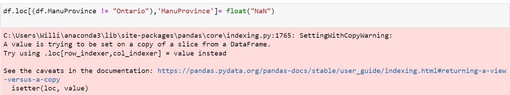

# William Kohlman's Notebook Reflection

## Personal Overall Reflection
Overall I took this course because I had enjoyed taking the summer class with Dr. Graham in 2020, however I put far too much on my plate at the time so I didn't put in as much effort as I should have. I wanted to take this class to one, better my understanding of digital history and broaden the tools I have in studying history, as well as exploring the Ottawa GLAM data. However I also wanted to make up for the fact that I had neglected my duties in his class the last time. This time I was fairly conscientous of that, I did slack off at the beginning a bit however I made sure to always comment on people's readings etc. However when some slack was given due to the circumstances (covid) I essentially took advantage of them and barely did any work. I realized I need something firmer to drive me, or perhaps just no the end times that are happening right now. Nonetheless I put some things off and eventually I realized I couldn't coast through on my brief knowledge of python, R, etc. I apologize again for my timeliness.

## The Notebook
When it came time for me to eventually start on the notebook, I realized how little I remembered both in general and from earlier in the class when we explored and learned the basics. This led to me having to spend more time going over previous class material just to ensure that I could do the notebook, and know what I was doing. While I was able to pick it up relatively quickly, thanks to a random friend I had on discord that also knew Jupyter Notebooks quite well, and reading the class discord occaisonally I was able to eventually complete it to a satisfactory level, but not as advanced as I would have liked to do. I would have been able to improve it more had I paid closer attention to what Dr. Graham had posted in the discord as I will mention later. It would have also helped me to start earlier so that when I realized I was heading in the wrong direction I would have had more time to correct and not feel trapped and alone. Initially I wanted to do some spatial analysis of the Ingenium data, however after building it out I quickly realized how much time and effort it would take to actually transform the data into usable geospatial data.

## What The Notebook is and how to use it
For the notebook I decided to look specifcally at the time when things were created in specific cities within the Ingenium dataset that is comprised of data from multiple museums in the Ottawa Area. I took this lens because I think it is important to realize the local contributions to these large scale museums and I was curious about when things were created. To do this I first had to ensure I had all the correct libraries installed for what I wanted to do. I settled on using the pandas, mumpy, plotly, bokeh, and matplotlib libraries. At first I had an error trying to install bokeh, but then I realized that I did not have the other required part, so after looking my error up I immediately realized that I needed to innstall pyproj for it to work properly. After installing them I then imported the specific aspects I would need all at the beginning of my notebook so that we can install and import them once and not have to worry about it later when visualizing the data. Then I imported the .csv file containing all of the data and displaued it to see what I was working with. To pare this giant dataset down, I removed the artifacts that had no BeginDate listed, since I knew I wanted to look at the temporal data so all the artifacts need to have a date associated with them. From there I further pared down the dataset by removing any artifacts that did not originate in Ontario. 
This occaisonally gives an error code on the first run, however subsequent runs work and do not produce an error. 

I encountered this error later as well when I was trying to map the data in a specific way, but I relented on that idea and went for a more simple histogram eventually.
Then I generate a list of all the cities that artifacts are attributed to in Ontario, and I selected the 15 that I recognized as being from the greater Ottawa area. Then I select for only those cities and further refine my dataset. This left me with 1835 artifacts.

Then I worked to create a simple scatterplot that shows the variation between the begindate and enddate of the manufcaturing of the artifacts. While most adhere to a very strict range of around a few years, some have great variance like a flag from Ottawa that started in 1867 and ended in 1963(May be related to when we developed our own 'new' flag). After that I ran a count to see how many artifacts each city had. If I had paid more attention to the discord channel, I would have seen on March 29th, Dr. Graham posted a walkthrough and code snippet grouping these together, something that I planned on doing but ran out of time to implement on my own.

This is then a logical step to improve on this notebook going forward. From here, by grouping them and graphing them by city you can explore when each city manufactured artifacts to see if there is a general trend or if it is random. I envision this being taken a step forward by having a line chart created with multiple lines for each city. The X Axis would be the Year and the Y Axis would be the count of how many artifacts were from that year. Each line would represent a city so you would be able to track their production through time.

Back to the notebook, after displaying a simple bar graph of the amount of artifacts by city, I created a histogram to display the total count by year from the cities in the Ottawa area. I included some stylization to add labels, titles, etc. and some spacing in to make the graph more visually appeasing.

## Why does this notebook matter?
I believe this notebook works to help visualize that the Ottawa area has manufactured a fair amount of artifacts that are also held in our museum's records. Normally when we think of manufactured goods from Canada, we often think of Southern Ontario, as they produce a ton of things there. However this notebook shows that there are contributions from many small towns around Ottawa to these museums, and that anybody from any town can manufacture history. Additionally, now that we have looked at areas around Ottawa, other humanities scholars may be interested in tracing the time when some of these towns were considered part of Ottawa proper, or when they were their own unique cities. There may be some tie into what the artefacts were that differentiated themselves from the ones form the outskirts compared to the city of Ottawa. These tools and tricks can be used to look at any town people want that is included in the dataset, and they can use these tools and visualizations on other datasets as well. This may open up further questions on whether or not artifacts from elsewhere in Canada go to their own local museums, or if they are brought in to larger museums.

## References from this notebook
Harper, Charlie. “Visualizing Data with Bokeh and Pandas.” Programming Historian, July 27, 2018. https://programminghistorian.org/en/lessons/visualizing-with-bokeh. 

Open data for Ingenium collections https://ingeniumcanada.org/collection-research/artifact-open-data-set-mash-up

“Histograms.” Plotly. Accessed April 27, 2021. https://plotly.com/python/histograms/. 

### Link to the live binder environment
https://mybinder.org/v2/gh/WilliamKohlman/Final-Notebook-Hist4916/ed16fd9e709375314dbf159e58211598fcc266c1 
